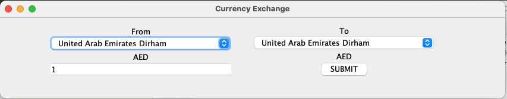
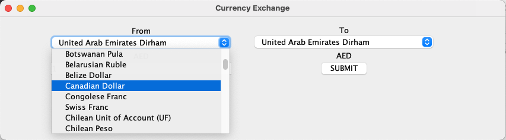
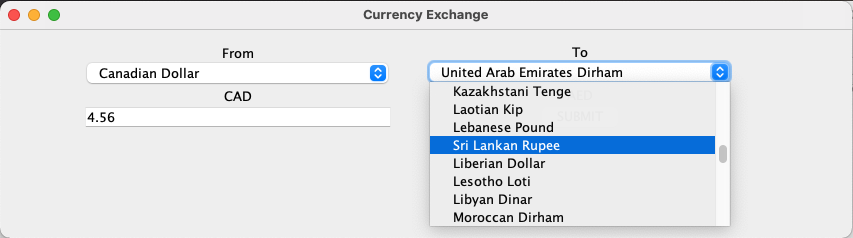
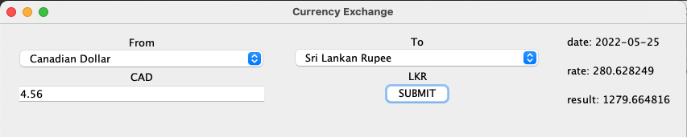

CurrencyConverter

Sara Stavnitser

This application allows users to find the value of their money in other currencies.

This project uses:
- [Retrofit](https://square.github.io/retrofit/)
- [Rx](https://github.com/ReactiveX/RxJava)
- [Gson](https://github.com/google/gson)
- [Mockito](https://site.mockito.org/)
- [Junit](https://junit.org/junit5/)
- [Gradle](https://gradle.org/)

App appearance when opened:

Choose original currency:

Choose target currency and enter amount:

Press submit and results are shown:

